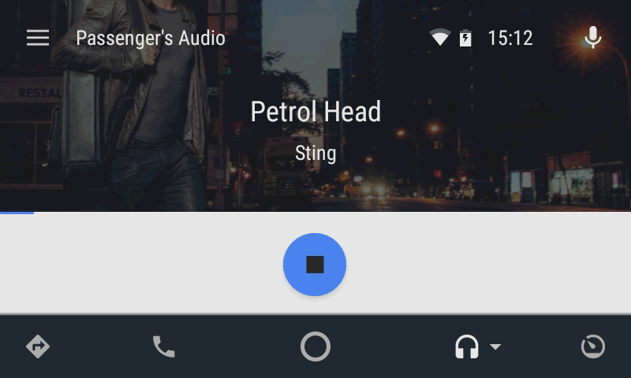
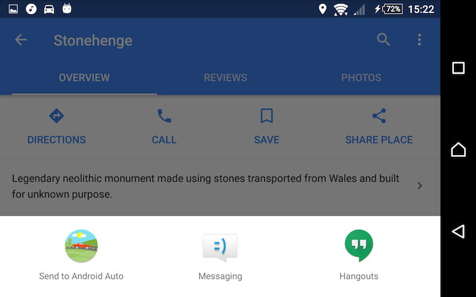
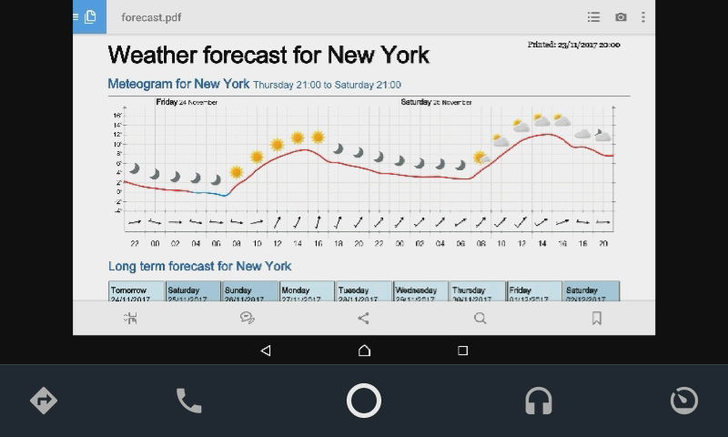

# AA Passenger – Android Auto control for passengers

This app allows a passenger to control an Android Auto device connected to the car.

Features:
 - Play your own music via car speakers

 - Send destinations from Google Maps to Android Auto for navigation

 - Display pictures on the Android Auto screen (e.g. the hotel, so the driver
   would easily find it)
   
## XDA Thread

https://forum.xda-developers.com/android-auto/android-auto-general/app-aa-passenger-remotely-control-t3713198

## What's new

- **1.9-alpha9**

    - AA Passenger: fixed Oreo crash
    - AA Passenger: fixed casting volume
    
- **1.9-alpha8**

    - audio streaming, without root! (experimental)
    - audio streaming, without passenger app! (experimental)
    - works also with Hotspot active on the driver's device
    - AA Passenger now also [available from Play Store](https://play.google.com/apps/testing/com.github.martoreto.aapassenger)
    - driver's app is now called AA 2nd Seat, not AA Remote
    - now compatible with Android 5.0 Lollipop
    - many bugs squashed
    - support for an NFC tag which launches or installs AA Passenger app

    Note that both driver's and passenger's apps must be updated to work
    together.

## Requirements
 
Two devices are needed: one would be connected to the car ("driver's device")
and have Android Auto app installed. The other ("passenger's device") will be
 able to control it.

The connection is established using either Wi-fi Direct (P2P) or Android Hotspot
(in this case Hotspot must be manually activated before starting Android Auto).

Note that Wi-fi Direct is not always robust and your mileage may vary.
Please test and report the results.

Note that this is now alpha quality, so expect some glitches and report them
in the XDA thread linked above.

Minimum supported Android version is ~~6.0~~5.0 (Lollipop).

Not officially supported for non-projected (on the phone screen) Android Auto,
although audio streaming seems to work.

## Installation

For initial setup and connection test no car is required. :)

### Driver's device
 
1. [Download](https://github.com/martoreto/aapassenger/releases) AA 2nd Seat APK
   and install it on the driver's device.
 
1. Open Android Auto app and enable "Unknown sources":

    - In the Android Auto app open the Hamburger menu.
    - Open About.
    - Tap "About Android Auto" header 10 times, until "Developer mode enabled" toast appears.
    - Tap dots on the top right of the screen.
    - Select "Developer settings" from the menu and enable "Unknown sources".
    
    If in doubt, see [this video](https://youtu.be/MjHpOaeOmOo).
 
### Passenger's device
 
1. Download the AA Passenger app [from Github](https://github.com/martoreto/aapassenger/releases)
   or [from Play Store](https://play.google.com/apps/testing/com.github.martoreto.aapassenger),
   install it on the passenger's device and run. A nice wizard will appear, guiding you through
   the next steps.

1. Enjoy.

## Non-standard audio streaming

Normally, to stream audio with the AA Passenger app, nothing special is needed.
When connected, the app displays an "Audio Streaming" button.

Below are described some ways to stream audio in a non-standard way.

#### Audio streaming without AA Passenger app (experimental)

1. Start Hotspot on the driver's device, then connect to the car and start Android Auto.

1. Connect with any Android phone to the hotspot.

1. Cast screen using Cast option in the Settings app or the quick settings bar.

   - Driver's device should be visible to Cast as "No-app Car Streaming".

   - If Cast is not in Settings,
     [use Google Home app](https://support.google.com/chromecast/answer/6059461?hl=en).

   - Do not use the Cast button found in media apps, like Play Music or Youtube.
     These use a different technology. Use system-wide screen mirroring,
     even though only audio will be streamed.

Please report your experiences in the XDA thread.

#### Audio streaming with root

1. If the passenger's device is rooted, you may install
   [Audio Capture Service](https://github.com/martoreto/audiocapture/releases)
   on it instead of relying on a trick with Cast.

## NFC tag

It's possible to make a nice and shiny NFC tag and place it in the car, so that the
passengers with NFC-capable phones can easily get the AA Passenger app.

Just [write the URL below to an NFC tag](https://www.tagstand.com/blog/nfc-how-guide-programming-url):

  https://storage.googleapis.com/aapassenger-static/nfc.html

If the AA Passenger app is already installed, tapping this tag will open it.
Otherwise the website above will be opened.

## Is it free?

AA Passenger App is ad-supported.

Pre-release AA 2nd Seat App versions will be free. What about releases? I haven't decided yet.

I'm also open-sourcing useful reusable components of the app. For now we have:
 - the media audio redirection service (https://github.com/martoreto/audiocapture)
 - nicely packaged Opus audio codec (https://github.com/martoreto/opuscodec)
 - updated [d2036a/android-mdns](https://github.com/d2036a/android-mdns)
   (mDNSResponder packaged for Android) with some fixes and missing features
   (https://github.com/martoreto/android-mdns)
 - the unofficial Android Auto SDK build scripts (https://github.com/martoreto/aauto-sdk)

## Screenshots

